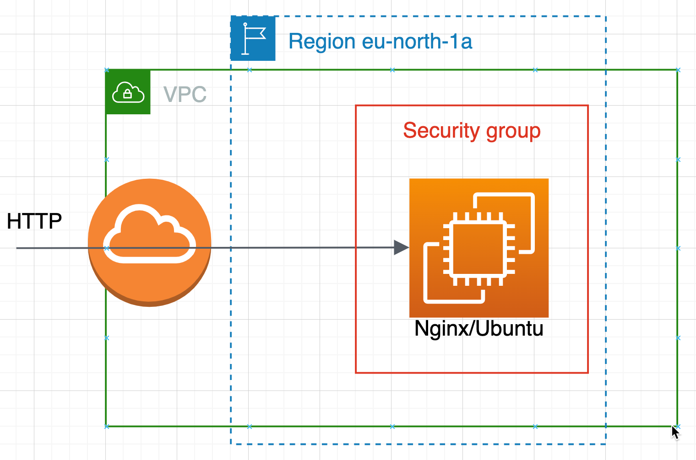

# terraform-nginx
terraform provision nginx/ubuntu on aws

# Topology


# How to use this repo
```
git clone git@github.com:ion-training/terraform-nginx.git && cd terraform-nginx
```

Add your AWS credentials as two environment variables:
```
export AWS_ACCESS_KEY_ID=<YOUR_ACCESS_KEY>
export AWS_SECRET_ACCESS_KEY=<YOUR_SECRET_KEY>
```

Create resources
```
terraform apply -auto-approve
```

Variables that can be changed:
- region - defaults to eu-north-1a
- prefix_name - defaults to "ion" used to prefix tags

